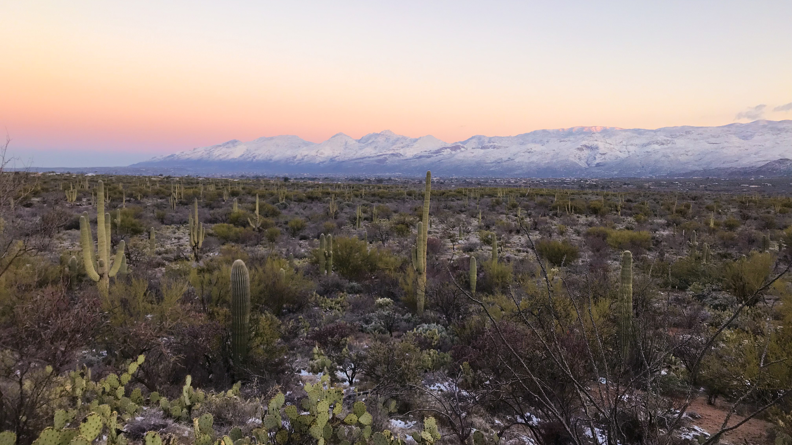

```{r setup, include=FALSE}
knitr::opts_chunk$set(echo = FALSE)
```



**Graduate Student and Sustainable Water Markets Fellow**

*UCSB Bren School of Environmental Science & Management* 

*Focus*: Economics and Politics of the Environment, Strategic Environmental Communication

My interests lie in finding actionable solutions to move the needle on water supply security in the western United States. Raised in a landscaped defined by the passage and absence of water, I became fascinated with the role water plays in our lives at an early age. 

Building on my background in field hydrology, I hope to leverage my technical expertise and experience as a Sustainable Water Markets fellow to accelerate public and private investment in quantifiable solutions to protect and promote our thriving West. 

When I'm not behind the screen, you'll catch me soaking up the sun and exploring the dusty corners of the southwest.  


